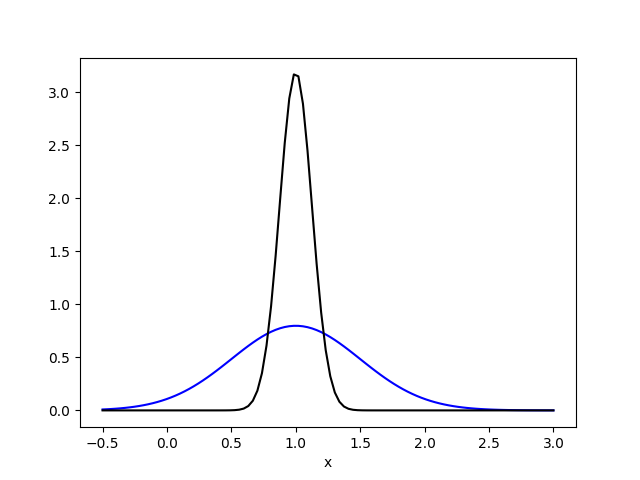
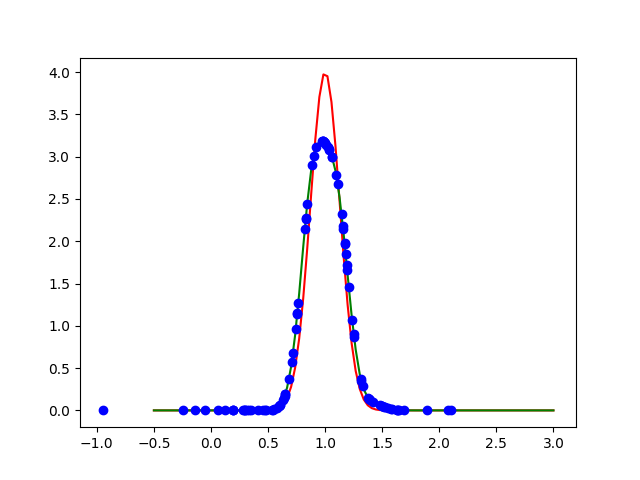

# Kullback-Leibler Importance Estimation Procedure

Estimates the density ratio of two density functions without estimating the
actual densities.

### Examples





### Prerequisites

This code relies upon the python packages:
* numpy
* matplotlib
* scipy

### Running

To produce the above graphs run:

```
./kliep.py
```
